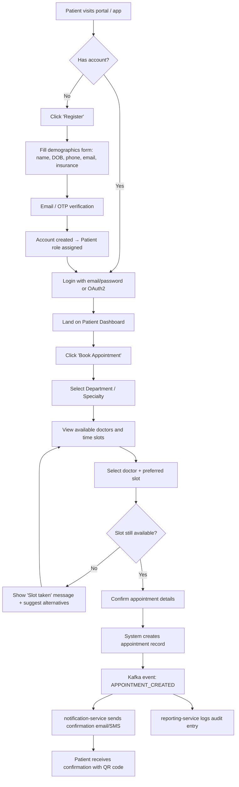
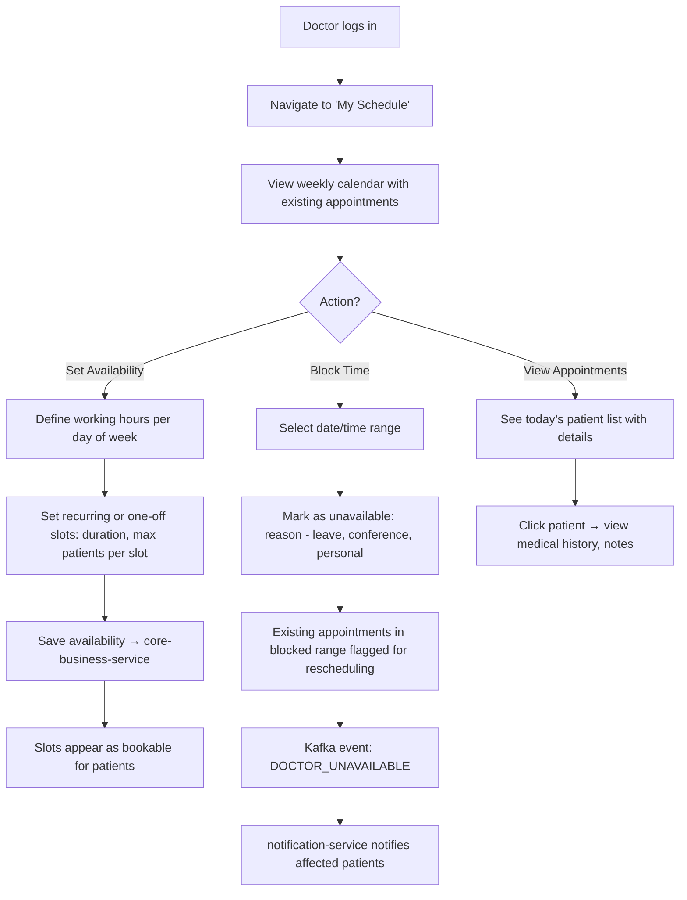
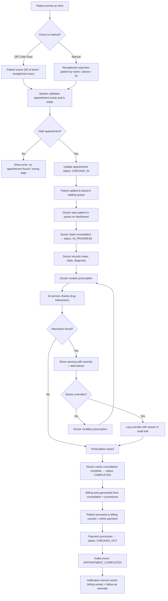
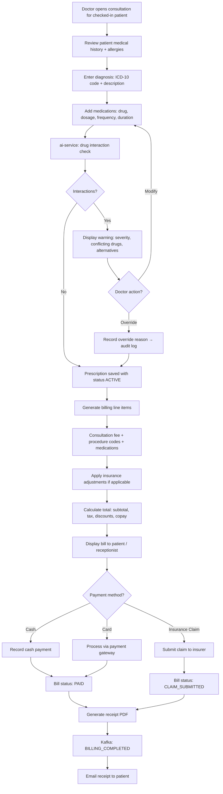
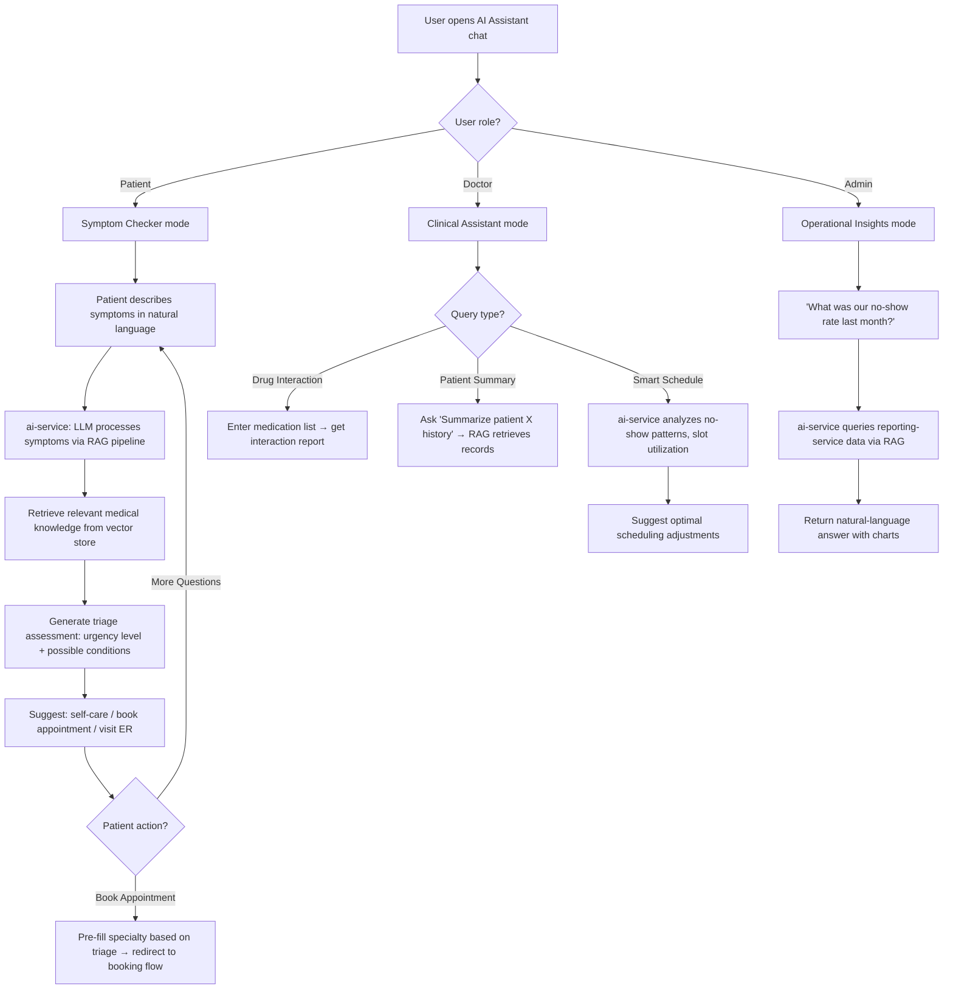

# Product Requirements Document (PRD)

## Healthcare Appointment & Patient Management System

| Field | Details |
|---|---|
| **Document Version** | 1.0 |
| **Date** | 2026-06-16 |
| **Status** | Draft — Pending Stakeholder Review |
| **Author** | Product & Architecture Team |
| **Target Release** | MVP — Q4 2026 |

---

## Table of Contents

1. [Problem Statement](#1-problem-statement)
2. [Solution Overview](#2-solution-overview)
3. [User Flow](#3-user-flow)
4. [API Design](#4-api-design)
5. [Edge Cases](#5-edge-cases)
6. [KPIs (Success Metrics / Acceptance Criteria)](#6-kpis-success-metrics--acceptance-criteria)
7. [Limitations](#7-limitations)

---

## 1. Problem Statement

### 1.1 Industry Challenges

Healthcare facilities worldwide face systemic operational inefficiencies that directly impact patient outcomes, staff productivity, and financial sustainability. The core challenges are:

| Challenge | Impact |
|---|---|
| **Fragmented Patient Data** | Patient records are scattered across paper files, legacy EMR systems, and disconnected spreadsheets. A single patient may have records in 3–5 different systems, leading to incomplete medical histories, duplicate tests, and diagnostic errors. |
| **Manual Scheduling** | Over 60% of small-to-mid-size clinics still rely on phone-based or walk-in scheduling. This causes an average 23% no-show rate, long patient wait times (30–45 min average), and under-utilization of physician time slots. |
| **Billing Errors & Revenue Leakage** | Manual billing processes produce error rates of 7–12%. Incorrect coding, missed charges, and delayed claim submissions lead to revenue leakage estimated at 3–5% of total revenue for typical clinics. |
| **Lack of Real-Time Insights** | Without consolidated dashboards, administrators cannot track appointment volumes, revenue trends, or staff utilization in real time. Decisions rely on month-end reports that are often 2–4 weeks stale. |
| **Prescription Management Risks** | Handwritten or uncoordinated prescriptions contribute to adverse drug interactions. The WHO estimates that medication errors affect 1 in every 30 patients, many of which are preventable with systematic drug-interaction checks. |
| **Communication Gaps** | Patients miss appointments due to lack of automated reminders. Staff members lack a unified notification system, leading to delayed follow-ups and lost patient engagement. |
| **Compliance & Audit Burden** | Healthcare regulations (HIPAA, GDPR, local health authority mandates) require comprehensive audit trails. Manual record-keeping makes audits time-consuming and error-prone. |

### 1.2 How This System Solves These Challenges

The **Healthcare Appointment & Patient Management System (HAPMS)** provides a unified, cloud-native platform that consolidates appointment scheduling, patient records, billing, prescriptions, and analytics into a single system of record. By leveraging a microservices architecture, event-driven communication, and AI-powered insights, HAPMS eliminates data silos, automates repetitive workflows, reduces errors, and empowers healthcare providers with real-time operational intelligence.

---

## 2. Solution Overview

### 2.1 Purpose & Vision

HAPMS is a **cloud-native, microservices-based healthcare management platform** designed to serve clinics, multi-specialty hospitals, and healthcare networks. The platform digitizes and automates the complete patient lifecycle — from registration and appointment booking through consultation, prescription, billing, and follow-up.

**Vision Statement:** *To be the intelligent operating system for healthcare facilities — where every appointment is optimized, every patient record is accessible, and every decision is data-informed.*

### 2.2 Key Value Propositions

| Value | Description |
|---|---|
| **Unified Patient 360° View** | A single pane of glass for all patient data — demographics, appointments, medical history, prescriptions, billing — accessible by authorized roles in real time. |
| **Intelligent Scheduling** | AI-powered appointment scheduling that considers doctor availability, patient preferences, procedure durations, and historical no-show patterns to maximize slot utilization. |
| **Automated Workflows** | End-to-end automation of check-in, consultation, prescription, billing, and follow-up — reducing manual touchpoints by an estimated 70%. |
| **Real-Time Analytics** | Live dashboards for administrators showing appointment volumes, revenue, staff utilization, and patient flow metrics. |
| **AI-Powered Clinical Assistance** | Symptom triage, drug interaction checks, smart scheduling suggestions, and natural-language query capabilities powered by LLM + RAG. |
| **Compliance by Design** | Immutable audit trails, role-based access control, encrypted data at rest and in transit, and HIPAA-aligned data handling. |
| **Scalable & Resilient Architecture** | Microservices deployed on Kubernetes, event-driven via Kafka, cached with Redis — designed for horizontal scaling and fault tolerance. |

### 2.3 Architecture Overview

```
┌─────────────────────────────────────────────────────────────────────────┐
│                        CLIENT LAYER                                     │
│   React 19 + TypeScript + Redux Toolkit + React Query + MUI/Tailwind   │
└──────────────────────────────┬──────────────────────────────────────────┘
                               │ HTTPS (JWT Bearer)
                               ▼
┌──────────────────────────────────────────────────────────────────────────┐
│                        API GATEWAY (Spring Cloud Gateway)                │
│   Rate Limiting · Request Routing · Load Balancing · Auth Propagation   │
└───┬──────────┬──────────┬──────────┬──────────┬──────────┬──────────────┘
    │          │          │          │          │          │
    ▼          ▼          ▼          ▼          ▼          ▼
┌────────┐ ┌────────┐ ┌──────────┐ ┌────────┐ ┌────────┐ ┌────────┐
│  auth  │ │  core  │ │notifica- │ │report- │ │   ai   │ │service │
│service │ │business│ │  tion    │ │  ing   │ │service │ │registry│
│        │ │service │ │ service  │ │service │ │        │ │(Eureka)│
└───┬────┘ └───┬────┘ └────┬─────┘ └───┬────┘ └───┬────┘ └────────┘
    │          │           │           │          │
    └──────────┴───────────┴───────────┴──────────┘
                           │
              ┌────────────┼────────────┐
              ▼            ▼            ▼
        ┌──────────┐ ┌──────────┐ ┌──────────┐
        │PostgreSQL│ │  Redis   │ │  Kafka   │
        │(+pgvector│ │  Cache   │ │ Broker   │
        │)         │ │          │ │          │
        └──────────┘ └──────────┘ └──────────┘
```

### 2.4 Microservices Breakdown

| Service | Responsibility | Database Schema |
|---|---|---|
| **auth-service** | User registration, login, JWT issuance/refresh, role management, OAuth2 integration | `users`, `roles`, `permissions`, `refresh_tokens` |
| **api-gateway** | Request routing, rate limiting, authentication forwarding, CORS, circuit breaking | Stateless (no DB) |
| **core-business-service** | Patient CRUD, appointment management, doctor profiles, prescriptions, billing, check-in/out workflows | `patients`, `doctors`, `appointments`, `prescriptions`, `billing`, `departments` |
| **notification-service** | Email, SMS, push notification delivery; template management; event consumption from Kafka | `notification_logs`, `templates`, `preferences` |
| **reporting-service** | Report generation (PDF/CSV), analytics aggregation, audit trail queries | `audit_logs`, `report_configs`, `scheduled_reports` |
| **ai-service** | Symptom triage, drug interaction checks, smart scheduling, natural-language queries over patient data via RAG + pgvector | `embeddings`, `ai_sessions`, `interaction_logs` |

### 2.5 MVP Scope

The MVP focuses on delivering a **production-ready foundation** with six functional pillars:

| MVP Pillar | Included Features |
|---|---|
| **User Management** | Registration, login, role assignment (Admin, Doctor, Receptionist, Patient), profile management |
| **Business Workflow** | Patient CRUD, appointment booking/cancel/reschedule, doctor availability, check-in/out, prescription entry, basic billing |
| **Dashboard** | Admin dashboard (appointment volume, revenue summary, patient demographics), doctor dashboard (today's schedule, pending prescriptions) |
| **Notifications** | Email notifications for appointment confirmations, reminders (24h before), cancellations, and billing receipts |
| **Reporting** | Appointment reports (daily/weekly/monthly), billing reports, audit trail viewer |
| **AI-Powered Insights** | Symptom-based triage chatbot, drug interaction alerts, smart scheduling suggestions |

---

## 3. User Flow

### 3.1 Primary Personas

| Persona | Description | Key Goals |
|---|---|---|
| **Patient** | End user seeking healthcare. May self-register or be registered by staff. | Book appointments, view medical history, receive reminders, pay bills. |
| **Doctor** | Licensed physician providing consultations. | Manage calendar, view patient records, create prescriptions, review AI insights. |
| **Receptionist** | Front-desk staff handling walk-ins, phone bookings, check-in/out. | Register patients, manage appointments, process check-in/out, handle billing. |
| **Admin** | Clinic/hospital administrator overseeing operations. | View dashboards, manage users and roles, generate reports, configure system settings. |

---

### 3.2 Flow 1: Patient Registration & Appointment Booking



**Step-by-Step Narrative:**

1. **Access Portal:** Patient navigates to the HAPMS web portal (React SPA).
2. **Registration (first-time):** Fills out a registration form with personal demographics, contact information, and optional insurance details. An OTP/email verification confirms identity. The `auth-service` creates the user account with the `PATIENT` role.
3. **Login:** Returning patients authenticate via email/password or social OAuth2 (Google). The `auth-service` issues a JWT access token (15 min TTL) and a refresh token (7 day TTL).
4. **Browse & Book:** The patient selects a department/specialty, views a calendar of available doctors and time slots (data from `core-business-service`), and selects their preferred option.
5. **Concurrency Guard:** The system uses optimistic locking (`version` column on the `appointment_slots` table) to prevent double-booking. If the slot was taken between page load and confirmation, the patient is shown alternative slots.
6. **Confirmation:** Upon successful booking, a Kafka event `APPOINTMENT_CREATED` is published. The `notification-service` consumes this event and sends an email/SMS confirmation with appointment details and a QR code for check-in.

---

### 3.3 Flow 2: Doctor Availability & Calendar Management



**Step-by-Step Narrative:**

1. **Login:** Doctor authenticates and lands on the Doctor Dashboard.
2. **Define Availability:** The doctor sets weekly recurring availability (e.g., Mon–Fri, 9 AM–5 PM, 20-minute slots) or creates one-off availability for special clinic days.
3. **Block Time Off:** If the doctor needs to block a day (leave, conference), they select the date range and mark it as unavailable. The system identifies any existing appointments in that range and flags them for rescheduling by the receptionist.
4. **Event Publication:** A `DOCTOR_UNAVAILABLE` Kafka event triggers the `notification-service` to notify affected patients about the need to reschedule.
5. **Daily View:** The doctor can view their daily schedule, see patient names, appointment types, and pre-consultation notes. Clicking a patient opens their medical history from the `core-business-service`.

---

### 3.4 Flow 3: Check-In / Check-Out Process



**Step-by-Step Narrative:**

1. **Arrival:** Patient arrives and checks in via QR code scan (generated at booking) or manually at the reception desk.
2. **Validation:** The system verifies the patient has a valid appointment for today. Status changes to `CHECKED_IN`.
3. **Waiting Queue:** The patient appears in the doctor's real-time waiting queue on their dashboard.
4. **Consultation:** The doctor begins the consultation, records clinical notes, vitals, and diagnosis. Status changes to `IN_PROGRESS`.
5. **Prescription:** The doctor creates a prescription. The `ai-service` automatically checks for drug interactions against the patient's current medications and allergies. If a conflict is detected, the doctor is warned and can modify or override (with a documented reason).
6. **Check-Out:** After consultation, billing is auto-generated based on the consultation type, procedures performed, and any medications prescribed. The patient pays at the counter or online. Status changes to `CHECKED_OUT`.
7. **Post-Visit:** A Kafka event triggers a billing receipt email and a follow-up reminder if applicable.

---

### 3.5 Flow 4: Prescription Generation & Billing



---

### 3.6 Flow 5: AI Assistant Interaction



**Step-by-Step Narrative:**

1. **Patient — Symptom Checker:**
   - The patient opens the AI chat and describes symptoms (e.g., "I've had a persistent headache and blurred vision for 3 days").
   - The `ai-service` uses an LLM (OpenAI GPT or local model) with a RAG pipeline that retrieves relevant clinical guidelines from a curated vector store (pgvector).
   - The system responds with a triage assessment (e.g., "Moderate urgency — these symptoms may indicate migraine or elevated blood pressure. We recommend booking an appointment with a neurologist or visiting the ER if symptoms worsen.").
   - **Disclaimer:** The AI clearly states it is not a substitute for professional medical advice.
   - If the patient chooses to book, the system pre-fills the specialty and redirects to the booking flow.

2. **Doctor — Clinical Assistant:**
   - Drug interaction queries: The doctor enters a list of medications, and the AI returns a detailed interaction report with severity levels.
   - Patient history summary: The doctor asks "Summarize John Doe's last 6 months," and the RAG pipeline retrieves and summarizes relevant records.
   - Smart scheduling: The AI analyzes historical appointment data to suggest optimal slot durations and buffer times.

3. **Admin — Operational Insights:**
   - The admin asks natural-language questions about clinic operations (e.g., "Which department had the highest revenue last quarter?").
   - The AI queries the `reporting-service` data and returns answers with supporting visualizations.

---

## 4. API Design

### 4.1 Overall Strategy

| Aspect | Decision |
|---|---|
| **API Style** | RESTful (JSON over HTTPS) for all service-to-client communication |
| **Internal Communication** | Synchronous REST (via Spring Cloud OpenFeign) for queries; Asynchronous Kafka events for state changes |
| **API Gateway** | Spring Cloud Gateway — single entry point, handles routing, rate limiting (100 req/min per user), JWT validation, CORS, request logging |
| **Versioning** | URI-based: `/api/v1/...` |
| **Documentation** | OpenAPI 3.0 (Swagger) auto-generated per service, aggregated at gateway |
| **Pagination** | Cursor-based for large collections; offset-based for reports |
| **Error Format** | RFC 7807 Problem Details (`application/problem+json`) |

### 4.2 Standard Error Response Format

```json
{
  "type": "https://hapms.io/errors/slot-unavailable",
  "title": "Appointment Slot Unavailable",
  "status": 409,
  "detail": "The requested slot 2026-07-15T10:00 with Dr. Smith is no longer available.",
  "instance": "/api/v1/appointments",
  "timestamp": "2026-06-16T12:00:00Z",
  "traceId": "abc-123-def-456"
}
```

### 4.3 Kafka Event Topics & Contracts

| Topic | Publisher | Consumers | Payload Key Fields |
|---|---|---|---|
| `appointment.created` | core-business-service | notification-service, reporting-service | `appointmentId`, `patientId`, `doctorId`, `dateTime`, `status` |
| `appointment.cancelled` | core-business-service | notification-service, reporting-service | `appointmentId`, `reason`, `cancelledBy` |
| `appointment.completed` | core-business-service | notification-service, reporting-service, ai-service | `appointmentId`, `diagnosis`, `prescriptionId`, `billingId` |
| `billing.completed` | core-business-service | notification-service, reporting-service | `billingId`, `patientId`, `totalAmount`, `paymentMethod` |
| `doctor.unavailable` | core-business-service | notification-service | `doctorId`, `unavailableFrom`, `unavailableTo`, `affectedAppointments[]` |
| `user.registered` | auth-service | notification-service, core-business-service | `userId`, `email`, `role` |
| `prescription.created` | core-business-service | notification-service, ai-service | `prescriptionId`, `patientId`, `medications[]` |
| `ai.triage.completed` | ai-service | reporting-service | `sessionId`, `patientId`, `urgencyLevel`, `suggestedSpecialty` |

---

### 4.4 Auth-Service Endpoints

**Base Path:** `/api/v1/auth`

#### POST `/api/v1/auth/register`
**Purpose:** Register a new user account.  
**Auth:** Public (no token required)

**Request:**
```json
{
  "email": "jane.doe@email.com",
  "password": "SecureP@ss123",
  "firstName": "Jane",
  "lastName": "Doe",
  "phone": "+1-555-0123",
  "role": "PATIENT"
}
```

**Response (201 Created):**
```json
{
  "userId": "uuid-1234",
  "email": "jane.doe@email.com",
  "role": "PATIENT",
  "status": "PENDING_VERIFICATION",
  "createdAt": "2026-06-16T10:00:00Z"
}
```

#### POST `/api/v1/auth/login`
**Purpose:** Authenticate user and issue JWT tokens.  
**Auth:** Public

**Request:**
```json
{
  "email": "jane.doe@email.com",
  "password": "SecureP@ss123"
}
```

**Response (200 OK):**
```json
{
  "accessToken": "eyJhbGciOiJSUzI1NiIs...",
  "refreshToken": "dGhpcyBpcyBhIHJlZnJlc2g...",
  "tokenType": "Bearer",
  "expiresIn": 900,
  "user": {
    "userId": "uuid-1234",
    "email": "jane.doe@email.com",
    "role": "PATIENT",
    "firstName": "Jane",
    "lastName": "Doe"
  }
}
```

#### POST `/api/v1/auth/refresh`
**Purpose:** Refresh an expired access token using a valid refresh token.  
**Auth:** Public (refresh token in body)

**Request:**
```json
{
  "refreshToken": "dGhpcyBpcyBhIHJlZnJlc2g..."
}
```

**Response (200 OK):**
```json
{
  "accessToken": "eyJhbGciOiJSUzI1NiIs...(new)",
  "refreshToken": "bmV3IHJlZnJlc2ggdG9rZW4...(rotated)",
  "expiresIn": 900
}
```

#### POST `/api/v1/auth/logout`
**Purpose:** Invalidate refresh token (server-side blacklist).  
**Auth:** Bearer token required

#### GET `/api/v1/auth/users` (Admin only)
**Purpose:** List all users with pagination and filters.  
**Auth:** `ROLE_ADMIN`

**Query Params:** `page`, `size`, `role`, `status`, `search`

**Response (200 OK):**
```json
{
  "content": [
    {
      "userId": "uuid-1234",
      "email": "jane.doe@email.com",
      "firstName": "Jane",
      "lastName": "Doe",
      "role": "PATIENT",
      "status": "ACTIVE",
      "createdAt": "2026-06-16T10:00:00Z"
    }
  ],
  "page": 0,
  "size": 20,
  "totalElements": 150,
  "totalPages": 8
}
```

#### PUT `/api/v1/auth/users/{userId}/role`
**Purpose:** Assign or change a user's role.  
**Auth:** `ROLE_ADMIN`

**Request:**
```json
{
  "role": "DOCTOR"
}
```

#### POST `/api/v1/auth/verify-email`
**Purpose:** Verify email via OTP or token link.  
**Auth:** Public

---

### 4.5 Core-Business-Service Endpoints

**Base Path:** `/api/v1`

#### Patient Management

| Method | Path | Purpose | Auth |
|---|---|---|---|
| POST | `/patients` | Create patient profile | `RECEPTIONIST`, `ADMIN` |
| GET | `/patients/{id}` | Get patient details | `DOCTOR`, `RECEPTIONIST`, `ADMIN`, `PATIENT` (own) |
| GET | `/patients` | Search/list patients | `DOCTOR`, `RECEPTIONIST`, `ADMIN` |
| PUT | `/patients/{id}` | Update patient info | `RECEPTIONIST`, `ADMIN`, `PATIENT` (own) |
| GET | `/patients/{id}/history` | Get patient medical history | `DOCTOR`, `ADMIN` |

**POST `/api/v1/patients` — Request:**
```json
{
  "userId": "uuid-1234",
  "dateOfBirth": "1990-05-15",
  "gender": "FEMALE",
  "bloodGroup": "O+",
  "address": {
    "street": "123 Main St",
    "city": "Springfield",
    "state": "IL",
    "zipCode": "62701"
  },
  "emergencyContact": {
    "name": "John Doe",
    "phone": "+1-555-0456",
    "relationship": "SPOUSE"
  },
  "insuranceInfo": {
    "provider": "BlueCross",
    "policyNumber": "BC-123456",
    "expiryDate": "2027-12-31"
  },
  "allergies": ["Penicillin", "Latex"]
}
```

**Response (201 Created):**
```json
{
  "patientId": "pat-uuid-5678",
  "userId": "uuid-1234",
  "mrn": "MRN-2026-00042",
  "dateOfBirth": "1990-05-15",
  "gender": "FEMALE",
  "bloodGroup": "O+",
  "allergies": ["Penicillin", "Latex"],
  "createdAt": "2026-06-16T10:05:00Z"
}
```

#### Doctor Management

| Method | Path | Purpose | Auth |
|---|---|---|---|
| POST | `/doctors` | Register doctor profile | `ADMIN` |
| GET | `/doctors/{id}` | Get doctor details | Any authenticated |
| GET | `/doctors` | List/search doctors (by specialty, department) | Any authenticated |
| PUT | `/doctors/{id}/availability` | Set doctor availability schedule | `DOCTOR` (own), `ADMIN` |
| GET | `/doctors/{id}/slots` | Get available booking slots for a date range | Any authenticated |

**PUT `/api/v1/doctors/{id}/availability` — Request:**
```json
{
  "weeklySchedule": [
    {
      "dayOfWeek": "MONDAY",
      "startTime": "09:00",
      "endTime": "17:00",
      "slotDurationMinutes": 20,
      "breakStart": "13:00",
      "breakEnd": "14:00"
    },
    {
      "dayOfWeek": "TUESDAY",
      "startTime": "09:00",
      "endTime": "13:00",
      "slotDurationMinutes": 20
    }
  ],
  "effectiveFrom": "2026-07-01",
  "effectiveTo": "2026-12-31"
}
```

**GET `/api/v1/doctors/{id}/slots?date=2026-07-15` — Response:**
```json
{
  "doctorId": "doc-uuid-789",
  "date": "2026-07-15",
  "slots": [
    { "startTime": "09:00", "endTime": "09:20", "status": "AVAILABLE" },
    { "startTime": "09:20", "endTime": "09:40", "status": "BOOKED" },
    { "startTime": "09:40", "endTime": "10:00", "status": "AVAILABLE" },
    { "startTime": "10:00", "endTime": "10:20", "status": "AVAILABLE" }
  ]
}
```

#### Appointment Management

| Method | Path | Purpose | Auth |
|---|---|---|---|
| POST | `/appointments` | Book a new appointment | `PATIENT`, `RECEPTIONIST` |
| GET | `/appointments/{id}` | Get appointment details | Owner, assigned Doctor, `RECEPTIONIST`, `ADMIN` |
| GET | `/appointments` | List appointments (filterable) | Role-based filtering |
| PUT | `/appointments/{id}/cancel` | Cancel an appointment | Owner, `RECEPTIONIST`, `ADMIN` |
| PUT | `/appointments/{id}/reschedule` | Reschedule to a new slot | Owner, `RECEPTIONIST` |
| PUT | `/appointments/{id}/check-in` | Check in a patient | `RECEPTIONIST` |
| PUT | `/appointments/{id}/start` | Start consultation | `DOCTOR` |
| PUT | `/appointments/{id}/complete` | Complete consultation | `DOCTOR` |

**POST `/api/v1/appointments` — Request:**
```json
{
  "patientId": "pat-uuid-5678",
  "doctorId": "doc-uuid-789",
  "departmentId": "dept-uuid-101",
  "appointmentDate": "2026-07-15",
  "startTime": "10:00",
  "type": "CONSULTATION",
  "reason": "Persistent headache and blurred vision",
  "notes": "Patient referred by GP"
}
```

**Response (201 Created):**
```json
{
  "appointmentId": "appt-uuid-3456",
  "patientId": "pat-uuid-5678",
  "doctorId": "doc-uuid-789",
  "appointmentDate": "2026-07-15",
  "startTime": "10:00",
  "endTime": "10:20",
  "status": "SCHEDULED",
  "type": "CONSULTATION",
  "qrCode": "base64-encoded-qr-string",
  "createdAt": "2026-06-16T10:10:00Z"
}
```

**PUT `/api/v1/appointments/{id}/cancel` — Request:**
```json
{
  "reason": "Personal emergency",
  "cancelledBy": "PATIENT"
}
```

#### Prescription Management

| Method | Path | Purpose | Auth |
|---|---|---|---|
| POST | `/prescriptions` | Create a prescription | `DOCTOR` |
| GET | `/prescriptions/{id}` | Get prescription details | `DOCTOR`, `PATIENT` (own), `ADMIN` |
| GET | `/patients/{id}/prescriptions` | Get all prescriptions for a patient | `DOCTOR`, `PATIENT` (own) |

**POST `/api/v1/prescriptions` — Request:**
```json
{
  "appointmentId": "appt-uuid-3456",
  "patientId": "pat-uuid-5678",
  "doctorId": "doc-uuid-789",
  "diagnosis": {
    "icd10Code": "G43.909",
    "description": "Migraine, unspecified, not intractable"
  },
  "medications": [
    {
      "drugName": "Sumatriptan",
      "dosage": "50mg",
      "frequency": "As needed, max 2/day",
      "duration": "30 days",
      "instructions": "Take at onset of migraine. Do not exceed 200mg in 24 hours."
    },
    {
      "drugName": "Ibuprofen",
      "dosage": "400mg",
      "frequency": "Every 6 hours as needed",
      "duration": "14 days",
      "instructions": "Take with food."
    }
  ],
  "notes": "Follow up in 2 weeks if symptoms persist. MRI recommended if no improvement."
}
```

**Response (201 Created):**
```json
{
  "prescriptionId": "rx-uuid-9012",
  "appointmentId": "appt-uuid-3456",
  "patientId": "pat-uuid-5678",
  "doctorId": "doc-uuid-789",
  "diagnosis": {
    "icd10Code": "G43.909",
    "description": "Migraine, unspecified, not intractable"
  },
  "medications": [ "..." ],
  "drugInteractionCheck": {
    "status": "CLEAR",
    "warnings": []
  },
  "status": "ACTIVE",
  "createdAt": "2026-06-16T11:30:00Z"
}
```

#### Billing Management

| Method | Path | Purpose | Auth |
|---|---|---|---|
| POST | `/billing` | Generate a bill for an appointment | `RECEPTIONIST`, `ADMIN`, system auto |
| GET | `/billing/{id}` | Get bill details | Owner, `RECEPTIONIST`, `ADMIN` |
| PUT | `/billing/{id}/pay` | Record a payment | `RECEPTIONIST`, `ADMIN` |
| GET | `/patients/{id}/billing` | Get patient billing history | Owner, `RECEPTIONIST`, `ADMIN` |

**POST `/api/v1/billing` — Request:**
```json
{
  "appointmentId": "appt-uuid-3456",
  "patientId": "pat-uuid-5678",
  "lineItems": [
    { "description": "General Consultation", "code": "99213", "amount": 150.00 },
    { "description": "Sumatriptan 50mg x 30", "code": "RX-001", "amount": 45.00 },
    { "description": "Ibuprofen 400mg x 56", "code": "RX-002", "amount": 12.00 }
  ],
  "insuranceAdjustment": -80.00,
  "discount": 0.00,
  "tax": 0.00
}
```

**Response (201 Created):**
```json
{
  "billingId": "bill-uuid-7890",
  "appointmentId": "appt-uuid-3456",
  "patientId": "pat-uuid-5678",
  "lineItems": [ "..." ],
  "subtotal": 207.00,
  "insuranceAdjustment": -80.00,
  "discount": 0.00,
  "tax": 0.00,
  "totalDue": 127.00,
  "status": "PENDING",
  "createdAt": "2026-06-16T11:35:00Z"
}
```

---

### 4.6 Notification-Service Endpoints

**Base Path:** `/api/v1/notifications`

| Method | Path | Purpose | Auth |
|---|---|---|---|
| GET | `/notifications` | Get notifications for current user | Any authenticated |
| PUT | `/notifications/{id}/read` | Mark notification as read | Owner |
| PUT | `/notifications/preferences` | Update notification preferences | Any authenticated |
| GET | `/notifications/templates` | List notification templates | `ADMIN` |
| PUT | `/notifications/templates/{id}` | Update a template | `ADMIN` |

> **Note:** The notification-service primarily operates as a Kafka consumer. It listens to events (`appointment.created`, `billing.completed`, etc.) and dispatches notifications via email (SMTP/SendGrid), SMS (Twilio), or in-app push. The REST endpoints above are for querying notification history and managing preferences.

---

### 4.7 Reporting-Service Endpoints

**Base Path:** `/api/v1/reports`

| Method | Path | Purpose | Auth |
|---|---|---|---|
| GET | `/reports/appointments` | Appointment analytics (daily/weekly/monthly) | `ADMIN`, `DOCTOR` |
| GET | `/reports/billing` | Revenue and billing reports | `ADMIN` |
| GET | `/reports/patients` | Patient demographics and volume | `ADMIN` |
| GET | `/reports/audit-trail` | Query audit logs | `ADMIN` |
| POST | `/reports/generate` | Generate a custom report (async → returns job ID) | `ADMIN` |
| GET | `/reports/jobs/{jobId}` | Check report generation status / download | `ADMIN` |

**GET `/api/v1/reports/appointments?from=2026-06-01&to=2026-06-30` — Response:**
```json
{
  "period": { "from": "2026-06-01", "to": "2026-06-30" },
  "totalAppointments": 1240,
  "completed": 1050,
  "cancelled": 120,
  "noShow": 70,
  "completionRate": "84.7%",
  "cancellationRate": "9.7%",
  "noShowRate": "5.6%",
  "averageWaitTimeMinutes": 18,
  "byDepartment": [
    { "department": "General Medicine", "count": 450 },
    { "department": "Orthopedics", "count": 280 },
    { "department": "Neurology", "count": 190 }
  ],
  "byDay": [
    { "date": "2026-06-01", "count": 42 },
    { "date": "2026-06-02", "count": 55 }
  ]
}
```

**GET `/api/v1/reports/audit-trail?entity=APPOINTMENT&entityId=appt-uuid-3456` — Response:**
```json
{
  "auditEntries": [
    {
      "id": "audit-001",
      "entity": "APPOINTMENT",
      "entityId": "appt-uuid-3456",
      "action": "CREATED",
      "performedBy": "uuid-1234",
      "performedByRole": "PATIENT",
      "timestamp": "2026-06-16T10:10:00Z",
      "changes": { "status": { "old": null, "new": "SCHEDULED" } }
    },
    {
      "id": "audit-002",
      "entity": "APPOINTMENT",
      "entityId": "appt-uuid-3456",
      "action": "CHECKED_IN",
      "performedBy": "uuid-5555",
      "performedByRole": "RECEPTIONIST",
      "timestamp": "2026-07-15T09:55:00Z",
      "changes": { "status": { "old": "SCHEDULED", "new": "CHECKED_IN" } }
    }
  ]
}
```

---

### 4.8 AI-Service Endpoints

**Base Path:** `/api/v1/ai`

| Method | Path | Purpose | Auth |
|---|---|---|---|
| POST | `/ai/triage` | Symptom triage (patient-facing) | `PATIENT` |
| POST | `/ai/drug-interactions` | Check drug interactions | `DOCTOR` |
| POST | `/ai/chat` | General AI assistant (context-aware) | Any authenticated |
| GET | `/ai/scheduling-insights` | Smart scheduling recommendations | `ADMIN`, `DOCTOR` |
| POST | `/ai/patient-summary` | Generate patient history summary | `DOCTOR` |

**POST `/api/v1/ai/triage` — Request:**
```json
{
  "patientId": "pat-uuid-5678",
  "symptoms": "I have had a persistent headache for 3 days, blurred vision, and occasional nausea.",
  "additionalContext": {
    "age": 36,
    "gender": "FEMALE",
    "knownConditions": ["Hypertension"],
    "currentMedications": ["Lisinopril 10mg"]
  }
}
```

**Response (200 OK):**
```json
{
  "sessionId": "ai-sess-001",
  "urgencyLevel": "MODERATE",
  "possibleConditions": [
    { "condition": "Migraine", "confidence": 0.72 },
    { "condition": "Hypertensive crisis", "confidence": 0.18 },
    { "condition": "Tension headache", "confidence": 0.10 }
  ],
  "recommendation": "Your symptoms suggest a possible migraine, but given your history of hypertension, we recommend scheduling an appointment with a neurologist within the next 48 hours. If you experience sudden severe headache, chest pain, or difficulty speaking, please visit the ER immediately.",
  "suggestedSpecialty": "NEUROLOGY",
  "disclaimer": "This assessment is AI-generated and is not a substitute for professional medical advice. Please consult a doctor for diagnosis and treatment.",
  "followUpQuestions": [
    "Have you checked your blood pressure recently?",
    "Is the headache worse in the morning?"
  ]
}
```

**POST `/api/v1/ai/drug-interactions` — Request:**
```json
{
  "patientId": "pat-uuid-5678",
  "currentMedications": ["Lisinopril 10mg", "Aspirin 81mg"],
  "newMedications": ["Ibuprofen 400mg"]
}
```

**Response (200 OK):**
```json
{
  "interactions": [
    {
      "drug1": "Ibuprofen",
      "drug2": "Lisinopril",
      "severity": "MODERATE",
      "description": "NSAIDs may reduce the antihypertensive effect of ACE inhibitors and increase the risk of renal impairment.",
      "recommendation": "Monitor blood pressure closely. Consider acetaminophen as an alternative analgesic."
    },
    {
      "drug1": "Ibuprofen",
      "drug2": "Aspirin",
      "severity": "MODERATE",
      "description": "Concurrent use may increase the risk of gastrointestinal bleeding and reduce the cardioprotective effect of low-dose aspirin.",
      "recommendation": "Take ibuprofen at least 30 minutes after or 8 hours before aspirin. Monitor for signs of GI bleeding."
    }
  ],
  "overallRiskLevel": "MODERATE",
  "alternatives": [
    { "instead_of": "Ibuprofen", "consider": "Acetaminophen 500mg", "reason": "No interaction with Lisinopril or Aspirin" }
  ]
}
```

---

### 4.9 OpenAPI / Swagger Summary

Each microservice exposes an OpenAPI 3.0 specification at:

| Service | Swagger UI | OpenAPI JSON |
|---|---|---|
| auth-service | `http://auth-service:8081/swagger-ui.html` | `http://auth-service:8081/v3/api-docs` |
| core-business-service | `http://core-service:8082/swagger-ui.html` | `http://core-service:8082/v3/api-docs` |
| notification-service | `http://notification-service:8083/swagger-ui.html` | `http://notification-service:8083/v3/api-docs` |
| reporting-service | `http://reporting-service:8084/swagger-ui.html` | `http://reporting-service:8084/v3/api-docs` |
| ai-service | `http://ai-service:8085/swagger-ui.html` | `http://ai-service:8085/v3/api-docs` |

The **API Gateway** aggregates all service specs and exposes a unified Swagger UI at `https://api.hapms.io/swagger-ui.html`.

---

## 5. Edge Cases

### 5.1 Double-Booking of Appointments (Concurrency)

| Aspect | Detail |
|---|---|
| **Scenario** | Two users (or the same user in two tabs) attempt to book the same doctor's time slot simultaneously. |
| **Root Cause** | Race condition between slot availability check and booking confirmation. |
| **Mitigation** | **Optimistic locking** using a `version` column on the `appointment_slots` table. When a booking is attempted, the system performs an `UPDATE ... WHERE slot_id = ? AND version = ? AND status = 'AVAILABLE'`. If 0 rows are updated (version mismatch or already booked), the transaction is rolled back and the user receives a `409 Conflict` response with alternative available slots. |
| **Additional** | Redis-based distributed lock (`SETNX` with TTL) on the slot key during the booking transaction for extra safety. |

### 5.2 Patient Cancellation / No-Show

| Aspect | Detail |
|---|---|
| **Cancellation** | Patients can cancel up to **2 hours** before the appointment via the portal. Cancellations within the 2-hour window require a phone call to reception. The `core-business-service` publishes `appointment.cancelled` → `notification-service` notifies the doctor + opens the slot for others. |
| **No-Show** | If a patient does not check in within **15 minutes** of the scheduled time, the system auto-updates status to `NO_SHOW`. A scheduled job (Spring `@Scheduled`) runs every 5 minutes to detect no-shows. The patient is notified, and the slot is released if the doctor has waitlisted patients. |
| **Repeat No-Shows** | Patients with ≥ 3 no-shows in 90 days are flagged. Future bookings require a confirmation callback from reception before the slot is reserved. |

### 5.3 Prescription Drug Interactions

| Aspect | Detail |
|---|---|
| **Scenario** | Doctor prescribes a medication that has a known interaction with the patient's current medications or allergies. |
| **Mitigation** | Before a prescription is saved, `core-business-service` calls `ai-service` `/drug-interactions` endpoint synchronously. If interactions are found, the response includes severity (MILD, MODERATE, SEVERE), description, and alternatives. **SEVERE** interactions block the prescription and require explicit doctor override with a documented reason logged to the audit trail. **MODERATE** interactions show a warning. **MILD** interactions are informational. |
| **Allergy Check** | The system cross-references prescribed drugs against the patient's allergy list. Prescribing a known allergen triggers a `CRITICAL` alert that cannot be overridden. |

### 5.4 Billing Discrepancies

| Aspect | Detail |
|---|---|
| **Scenario** | A bill contains incorrect charges, duplicate line items, or insurance adjustment errors. |
| **Mitigation** | Bills are auto-generated from appointment data (consultation code, procedures, prescriptions) to minimize manual errors. All bill modifications are tracked in the audit trail. A `BILLING_DISPUTE` status allows patients/receptionists to flag a bill for review. Disputed bills are routed to the admin queue. |
| **Idempotency** | The `/billing` POST endpoint uses an idempotency key (`appointmentId + billing type`) to prevent duplicate bill creation on retries. |

### 5.5 Network Failures / Service Degradation

| Aspect | Detail |
|---|---|
| **Circuit Breaker** | Spring Cloud Circuit Breaker (Resilience4j) wraps all inter-service calls. If a downstream service fails 5 times in 60 seconds, the circuit opens for 30 seconds, returning a fallback response (cached data or a graceful error). |
| **Kafka Delivery** | Kafka producers use `acks=all` with `retries=3` and `idempotence=true` to guarantee at-least-once delivery. Consumers use manual offset commits after successful processing. Dead-letter topics (`*.dlq`) capture messages that fail processing after 3 retries for manual review. |
| **Database Failover** | PostgreSQL configured with streaming replication (primary + standby). Connection pooling via HikariCP with `connectionTimeout=30s` and `maxPoolSize=20` per service. |
| **Redis Failover** | Redis Sentinel for automatic failover. Cache misses gracefully fall through to the database. |
| **API Gateway Timeout** | Gateway enforces a 10-second timeout per request. If a service doesn't respond, the gateway returns `504 Gateway Timeout` with a human-readable error. |

### 5.6 Invalid or Malformed Input Data

| Aspect | Detail |
|---|---|
| **Validation Layer** | Jakarta Bean Validation (`@NotNull`, `@Email`, `@Pattern`, `@Size`) on all request DTOs. Custom validators for domain-specific rules (e.g., appointment date must be in the future, dosage must be a positive number). |
| **Error Response** | Validation errors return `400 Bad Request` with a detailed error body listing each invalid field, the rejected value, and the expected constraint. |
| **SQL Injection / XSS** | All inputs are parameterized (JPA/Hibernate). HTML inputs are sanitized. Content Security Policy headers are set by the API gateway. |

**Example 400 response:**
```json
{
  "type": "https://hapms.io/errors/validation-error",
  "title": "Validation Failed",
  "status": 400,
  "detail": "2 validation errors",
  "errors": [
    {
      "field": "email",
      "rejectedValue": "not-an-email",
      "message": "Must be a valid email address"
    },
    {
      "field": "password",
      "rejectedValue": "123",
      "message": "Must be at least 8 characters with 1 uppercase, 1 number, and 1 special character"
    }
  ]
}
```

### 5.7 Session Expiry and Token Refresh

| Aspect | Detail |
|---|---|
| **Access Token TTL** | 15 minutes. Short-lived to limit the blast radius of a compromised token. |
| **Refresh Token TTL** | 7 days. Stored server-side in Redis (keyed by user ID). Only one active refresh token per user; issuing a new one invalidates the previous (rotation). |
| **Frontend Handling** | The React app uses an Axios interceptor. On receiving a `401 Unauthorized`, the interceptor automatically calls `/auth/refresh` with the stored refresh token. If refresh succeeds, the original request is retried transparently. If refresh fails (expired/revoked), the user is redirected to login. |
| **Concurrent Requests** | A request queue is maintained during token refresh to prevent multiple simultaneous refresh calls. |
| **Logout** | Calling `/auth/logout` deletes the refresh token from Redis and adds the current access token's `jti` to a short-lived blacklist (Redis SET with TTL = remaining token lifetime). |

### 5.8 Additional Edge Cases

| Edge Case | Handling |
|---|---|
| **Duplicate patient registration** | Unique constraint on `(email)` + fuzzy match on `(firstName, lastName, dateOfBirth)`. If a potential duplicate is detected, the receptionist is prompted to merge or create separately. |
| **Concurrent prescription modification** | Prescriptions are immutable once saved. Modifications create a new version with a reference to the previous one, maintaining a full history chain. |
| **Large file uploads (reports/images)** | File uploads are streamed to object storage (S3-compatible) with a 10 MB limit. Upload progress is reported via WebSocket. |
| **Timezone handling** | All timestamps are stored in UTC. The frontend converts to the user's local timezone for display. Doctor availability is defined in the clinic's timezone, converted to UTC for storage. |
| **Rate limiting bypass attempts** | API Gateway enforces rate limits per API key/user ID using Redis sliding window counters. Exceeding the limit returns `429 Too Many Requests` with `Retry-After` header. |

---

## 6. KPIs (Success Metrics / Acceptance Criteria)

### 6.1 Technical Metrics

| KPI | Target | Measurement Method |
|---|---|---|
| **API Response Time (P95)** | < 200 ms | Prometheus histogram on API Gateway |
| **API Response Time (P99)** | < 500 ms | Prometheus histogram on API Gateway |
| **System Uptime** | ≥ 99.9% (< 8.76 hrs downtime/year) | Prometheus up/down metrics + Grafana alerting |
| **Appointment Booking Success Rate** | > 99.5% | (successful bookings / total booking attempts) tracked in core-business-service |
| **Kafka Event Processing Latency** | < 2 seconds (P95) | Kafka consumer lag metrics in Prometheus |
| **Database Query Performance** | < 50 ms for 90% of queries | PostgreSQL `pg_stat_statements` monitoring |
| **Error Rate (5xx)** | < 0.1% of total requests | API Gateway error rate dashboard |
| **JWT Token Refresh Success Rate** | > 99.9% | Auth-service metrics |
| **Cache Hit Rate (Redis)** | > 80% for frequently accessed data | Redis `INFO` stats |
| **Deployment Frequency** | ≥ 2 deployments per week | GitHub Actions pipeline metrics |
| **Mean Time to Recovery (MTTR)** | < 15 minutes | Incident response logs |

### 6.2 Business Metrics

| KPI | Target | Measurement Method | Timeline |
|---|---|---|---|
| **Staff Adoption Rate** | ≥ 80% of clinic staff actively using the system | Monthly active users / total registered staff | Within 3 months of launch |
| **Patient Portal Adoption** | ≥ 40% of patients use online booking | Online bookings / total bookings | Within 6 months of launch |
| **No-Show Rate Reduction** | ≤ 10% (from baseline ~23%) | (no-shows / scheduled appointments) × 100 | Within 6 months of launch |
| **Billing Error Reduction** | ≥ 40% reduction from baseline | Disputed bills / total bills generated | Within 3 months of launch |
| **Average Patient Wait Time** | ≤ 15 minutes | Time from check-in to consultation start | Within 3 months of launch |
| **Appointment Utilization Rate** | ≥ 85% of available slots filled | Booked slots / total available slots | Within 6 months of launch |
| **Patient Satisfaction (NPS)** | ≥ 50 | Post-visit survey scores | Quarterly |
| **Revenue Cycle Improvement** | Days in A/R reduced by 20% | Average days from billing to payment | Within 6 months of launch |

### 6.3 AI-Specific Metrics

| KPI | Target | Measurement Method |
|---|---|---|
| **Symptom Triage Accuracy** | ≥ 85% match with doctor's eventual diagnosis | Retrospective comparison: AI suggested specialty vs. actual consultation specialty |
| **Drug Interaction Detection Rate** | 100% detection for SEVERE interactions | Quarterly audit: known interaction database vs. flagged prescriptions |
| **AI Response Latency** | < 3 seconds for triage, < 5 seconds for patient summary | Prometheus metrics on ai-service |
| **AI Assistant User Engagement** | ≥ 30% of users interact with AI features monthly | AI session counts / total active users |
| **False Positive Rate (Triage)** | < 15% of URGENT triage recommendations result in non-urgent diagnosis | Post-consultation outcome review |

### 6.4 Acceptance Criteria (MVP Go-Live)

The MVP will be considered ready for production when **all** of the following criteria are met:

- [ ] All microservices pass integration tests with > 80% code coverage
- [ ] End-to-end test suite covering all 5 primary user flows passes consistently
- [ ] Load test: System handles 500 concurrent users with P95 response time < 200ms
- [ ] Security audit: No CRITICAL or HIGH vulnerabilities in OWASP ZAP scan
- [ ] RBAC verification: Each role can access only its authorized endpoints (tested via automated role matrix)
- [ ] Kafka event delivery verified: All events are consumed and processed within 2 seconds under normal load
- [ ] Data backup and restore procedure validated
- [ ] Monitoring dashboards operational: Grafana dashboards for all services, alerting configured for critical metrics
- [ ] UAT sign-off from at least 2 doctors, 2 receptionists, and 1 admin user
- [ ] Performance baseline documented for future regression comparison

---

## 7. Limitations

### 7.1 What the MVP Does NOT Cover

| Exclusion | Rationale | Future Roadmap |
|---|---|---|
| **Full EHR/EMR Integration** | Requires complex HL7 FHIR integration, compliance certification, and vendor partnerships. Too complex for MVP. | Phase 2 — HL7 FHIR adapter service, integration with Epic, Cerner, etc. |
| **Telemedicine / Video Consultation** | Requires WebRTC infrastructure, HIPAA-compliant video streaming, and separate mobile SDKs. | Phase 2 — Telemedicine module with video/audio, screen sharing, and recording. |
| **Multi-Language Support (i18n)** | MVP targets English-speaking markets. Internationalization requires translation infrastructure and cultural localization. | Phase 3 — i18n framework with support for Spanish, Hindi, Arabic, and Mandarin. |
| **Native Mobile Applications** | MVP delivers a responsive web application. Native iOS/Android apps require separate development. | Phase 2 — React Native mobile app sharing business logic with web. |
| **Insurance Claim Auto-Adjudication** | Requires integration with payer systems and real-time eligibility verification, which varies by region. | Phase 3 — EDI 837/835 integration with major insurance providers. |
| **Pharmacy Integration** | Direct e-prescribing to pharmacies requires NCPDP/SCRIPT certification. | Phase 3 — e-prescribing via Surescripts. |
| **Lab & Imaging Orders** | Integration with lab information systems (LIS) and radiology information systems (RIS). | Phase 2 — DICOM/HL7 integration. |
| **Offline Mode** | The system requires an active internet connection for all operations. | Phase 3 — Progressive Web App with offline queuing and sync. |
| **Patient-Uploaded Documents** | Patients cannot upload medical documents, images, or insurance cards in MVP. | Phase 2 — Document management module with OCR. |

### 7.2 Technical Constraints

| Constraint | Detail |
|---|---|
| **Single-Tenant Architecture** | MVP is designed for a single clinic or hospital. Multi-tenancy (shared infrastructure, tenant isolation) is planned for Phase 3. |
| **Scalability Ceiling** | MVP is tested and optimized for **up to 1,000 concurrent users** and **50,000 patient records**. Beyond this, database partitioning and additional Kubernetes scaling policies are required. |
| **AI Model Dependency** | The AI features depend on OpenAI API availability. If OpenAI is unreachable, AI features degrade gracefully (drug interactions fall back to a local rule-based engine; triage and chat are unavailable). A local LLM fallback is planned for Phase 2. |
| **Email/SMS Provider Dependency** | Notification delivery depends on third-party providers (SendGrid for email, Twilio for SMS). Provider outages will delay notifications. In-app notifications remain functional. |
| **No Audit Immutability Guarantee** | Audit logs are stored in PostgreSQL with application-level immutability (no UPDATE/DELETE on audit tables). For regulatory-grade immutability, a blockchain-based or append-only storage solution is planned for Phase 3. |
| **Browser Support** | MVP supports the latest 2 versions of Chrome, Firefox, Safari, and Edge. Internet Explorer is not supported. |

### 7.3 Assumptions

| # | Assumption |
|---|---|
| 1 | The deploying clinic has **reliable internet connectivity** (≥ 10 Mbps) for all staff workstations. |
| 2 | **Staff training** will be conducted before go-live (minimum 2 half-day sessions per role). |
| 3 | The clinic has an existing **email/SMS infrastructure** or is willing to subscribe to SendGrid/Twilio. |
| 4 | The **operating environment** supports Docker and Kubernetes (cloud provider: AWS, GCP, or Azure, or on-premises Kubernetes cluster). |
| 5 | A **domain name and SSL certificate** are available for the production deployment. |
| 6 | Patient data migration from legacy systems (if any) will be handled as a **separate project** with a custom ETL pipeline. |
| 7 | The clinic's **billing codes and fee schedule** will be configured during the setup phase. |
| 8 | All users have access to a **modern web browser** (Chrome 90+, Firefox 88+, Safari 14+, Edge 90+). |

### 7.4 Dependencies

| Dependency | Type | Risk Level | Mitigation |
|---|---|---|---|
| **PostgreSQL 15+** | Infrastructure | Low | Widely available on all cloud providers. Managed options (RDS, Cloud SQL) preferred. |
| **Redis 7+** | Infrastructure | Low | Use managed Redis (ElastiCache, Memorystore). |
| **Apache Kafka** | Infrastructure | Medium | Use managed Kafka (Confluent Cloud, Amazon MSK) to reduce operational burden. Fallback: synchronous HTTP calls with retry. |
| **OpenAI API** | External Service | Medium | Rate limits and availability are external factors. Mitigation: local LLM (Ollama/vLLM) fallback, response caching, graceful degradation. |
| **SendGrid / Twilio** | External Service | Low | Well-established SaaS providers. Fallback: in-app notifications remain functional without email/SMS. |
| **Docker / Kubernetes** | Infrastructure | Low | Standard tooling. Use managed K8s (EKS, GKE, AKS). |
| **GitHub Actions** | CI/CD | Low | Migrate to GitLab CI or Jenkins if GitHub becomes unavailable. |

### 7.5 Future Roadmap

```mermaid
gantt
    title HAPMS Product Roadmap
    dateFormat  YYYY-Q
    axisFormat  %Y-Q%q

    section Phase 1 - MVP
    User Management           :done, p1a, 2026-Q3, 2026-Q4
    Appointments & Scheduling :done, p1b, 2026-Q3, 2026-Q4
    Billing (Basic)           :done, p1c, 2026-Q3, 2026-Q4
    Dashboard & Reports       :done, p1d, 2026-Q3, 2026-Q4
    AI Triage & Drug Check    :done, p1e, 2026-Q3, 2026-Q4
    Notifications             :done, p1f, 2026-Q3, 2026-Q4

    section Phase 2
    Telemedicine Module       :p2a, 2027-Q1, 2027-Q2
    React Native Mobile App   :p2b, 2027-Q1, 2027-Q2
    Lab & Imaging Integration :p2c, 2027-Q1, 2027-Q2
    Document Management (OCR) :p2d, 2027-Q1, 2027-Q2
    Local LLM Fallback        :p2e, 2027-Q1, 2027-Q2

    section Phase 3
    EHR/FHIR Integration      :p3a, 2027-Q3, 2027-Q4
    Multi-Tenancy             :p3b, 2027-Q3, 2027-Q4
    i18n / Localization       :p3c, 2027-Q3, 2027-Q4
    Insurance Auto-Adjudication:p3d, 2027-Q3, 2027-Q4
    Offline / PWA Mode        :p3e, 2027-Q3, 2027-Q4
    e-Prescribing (Surescripts):p3f, 2027-Q3, 2027-Q4
```

---

*— End of PRD —*

*This document is a living artifact. Updates will be versioned and communicated to all stakeholders. For questions or feedback, please contact the Product & Architecture Team.*
